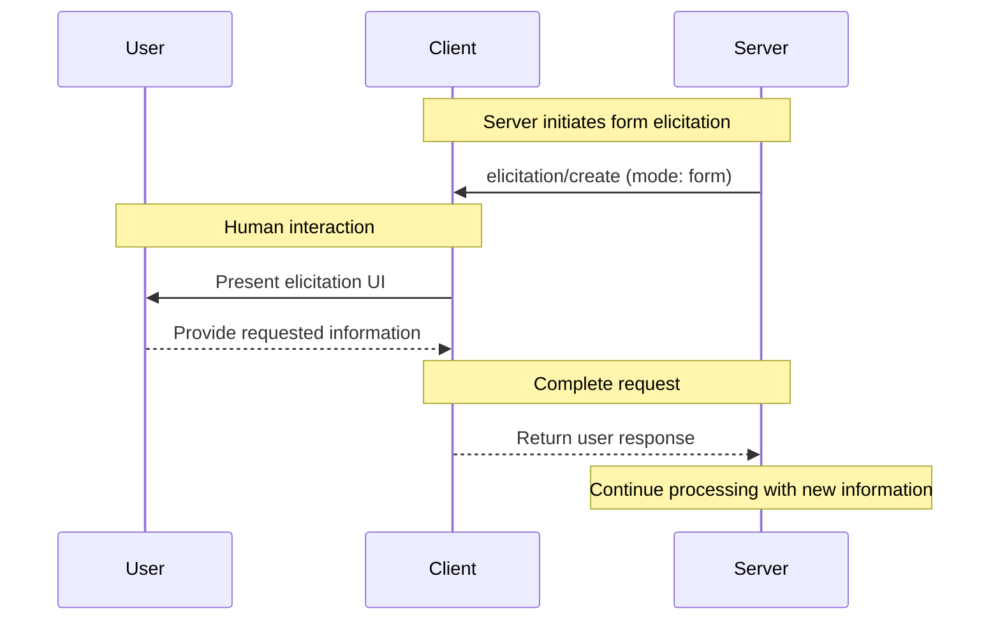
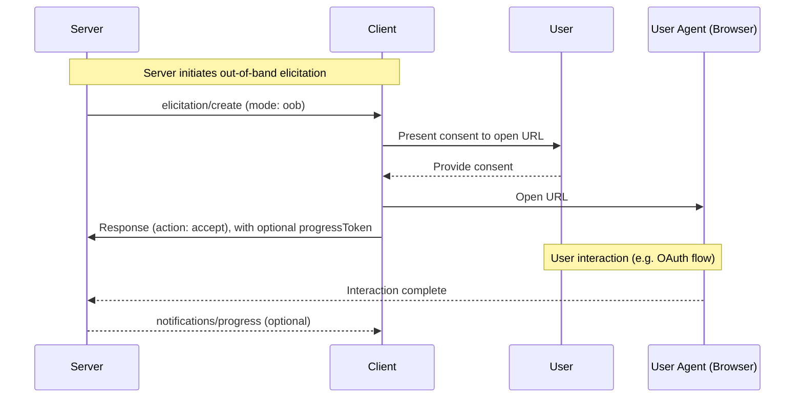
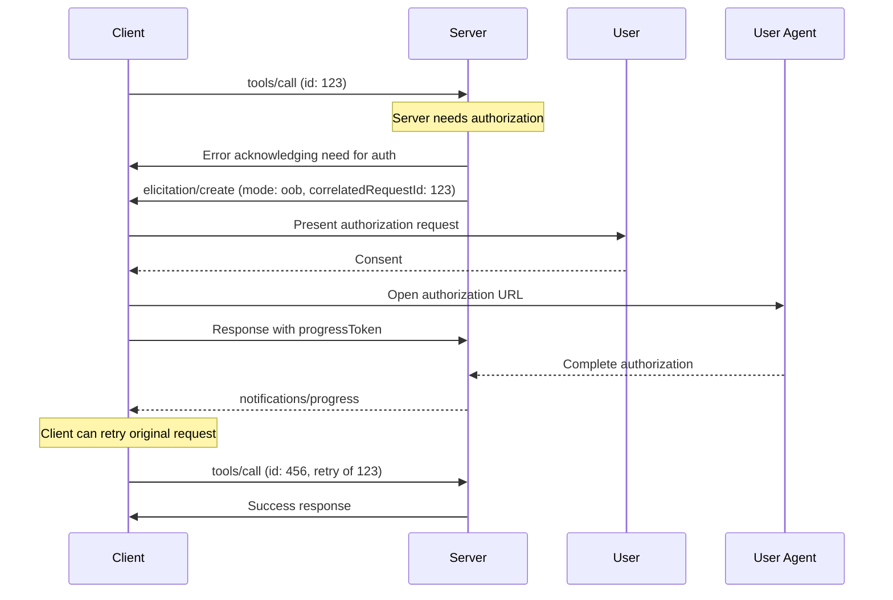

<div id="enable-section-numbers" />

<Info>**Protocol Revision**: draft</Info>

<Note>

Elicitation is newly introduced in this version of the MCP specification and its design may evolve in future protocol versions.

</Note>

The Model Context Protocol (MCP) provides a standardized way for servers to request additional
information from users through the client during interactions. This flow allows clients to
maintain control over user interactions and data sharing while enabling servers to gather
necessary information dynamically.

Elicitation supports two modes:

- **Form mode** (in-band): Servers can request structured data from users with optional JSON schemas to validate responses
- **Out-of-band mode**: Servers can direct users to external URLs for interactions that should not pass through the MCP client, such as OAuth authorization flows

## User Interaction Model

Elicitation in MCP allows servers to implement interactive workflows by enabling user input
requests to occur _nested_ inside other MCP server features.

Implementations are free to expose elicitation through any interface pattern that suits
their needs&mdash;the protocol itself does not mandate any specific user interaction
model.

<Warning>

For trust & safety and security:

- Servers **MUST NOT** use form mode elicitation to request sensitive information
- Servers **MUST** use out-of-band mode for OAuth flows and other security-sensitive interactions
- URLs **MUST NOT** appear in form mode messages or schemas

Applications **SHOULD**:

- Provide UI that makes it clear which server is requesting information
- For out-of-band mode, clearly display the target domain/host before navigation
- Allow users to review and modify their responses before sending
- Respect user privacy and provide clear reject and cancel options

</Warning>

## Capabilities

Clients that support elicitation **MUST** declare the `elicitation` capability during
[initialization](/specification/draft/basic/lifecycle#initialization):

```json
{
  "capabilities": {
    "elicitation": {}
  }
}
```

Clients **MAY** specify which elicitation modes they support:

```json
{
  "capabilities": {
    "elicitation": {
      "modes": ["form", "oob"]
    }
  }
}
```

If the `modes` array is not present, servers **MUST** assume the client only supports `form` mode for backward compatibility.

Servers **MUST NOT** send elicitation requests with modes that are not explicitly declared by the client.

## Protocol Messages

### Creating Elicitation Requests

To request information from a user, servers send an `elicitation/create` request. The request **MUST** include a `mode` parameter that specifies the type of elicitation:

- `"form"` (default): In-band structured data collection with optional schema validation
- `"oob"`: Out-of-band interaction via URL navigation

#### Form Mode (In-Band)

Form mode allows servers to collect structured data directly through the MCP client.

##### Simple Text Request

**Request:**

```json
{
  "jsonrpc": "2.0",
  "id": 1,
  "method": "elicitation/create",
  "params": {
    "mode": "form", // Optional, defaults to "form"
    "message": "Please provide your GitHub username",
    "requestedSchema": {
      "type": "object",
      "properties": {
        "name": {
          "type": "string"
        }
      },
      "required": ["name"]
    }
  }
}
```

**Response:**

```json
{
  "jsonrpc": "2.0",
  "id": 1,
  "result": {
    "action": "accept",
    "content": {
      "name": "octocat"
    }
  }
}
```

##### Structured Data Request

**Request:**

```json
{
  "jsonrpc": "2.0",
  "id": 2,
  "method": "elicitation/create",
  "params": {
    "mode": "form",
    "message": "Please provide your contact information",
    "requestedSchema": {
      "type": "object",
      "properties": {
        "name": {
          "type": "string",
          "description": "Your full name"
        },
        "email": {
          "type": "string",
          "format": "email",
          "description": "Your email address"
        },
        "age": {
          "type": "number",
          "minimum": 18,
          "description": "Your age"
        }
      },
      "required": ["name", "email"]
    }
  }
}
```

**Response:**

```json
{
  "jsonrpc": "2.0",
  "id": 2,
  "result": {
    "action": "accept",
    "content": {
      "name": "Monalisa Octocat",
      "email": "octocat@github.com",
      "age": 30
    }
  }
}
```

#### Out-of-Band Mode

Out-of-band mode enables servers to direct users to external URLs for interactions that should not pass through the MCP client. This is essential for OAuth flows, payment processing, and other security-sensitive operations.

**Request:**

```json
{
  "jsonrpc": "2.0",
  "id": 3,
  "method": "elicitation/create",
  "params": {
    "mode": "oob",
    "url": "https://oauth.example.com/authorize?client_id=abc123&response_type=code&...",
    "message": "Authorization is required to access your Example Co files."
  }
}
```

**Response with Progress Tracking:**

```json
{
  "jsonrpc": "2.0",
  "id": 3,
  "result": {
    "_meta": {
      "progressToken": "oob-progress-456" // Client wants progress updates
    },
    "action": "accept"
  }
}
```

The server can then send [progress notifications](/docs/specification/draft/basic/utilities/progress.mdx):

```json
{
  "jsonrpc": "2.0",
  "method": "notifications/progress",
  "params": {
    "progressToken": "oob-progress-456",
    "progress": 100,
    "total": 100,
    "message": "Authorization completed successfully"
  }
}
```

#### Decline and Cancel Response Examples

For all non-accept responses, the `content` field is omitted. The response payloads are identical for either form or out-of-band mode.

**Reject Response Example:**

```json
{
  "jsonrpc": "2.0",
  "id": 2,
  "result": {
    "action": "reject"
  }
}
```

**Cancel Response Example:**

```json
{
  "jsonrpc": "2.0",
  "id": 2,
  "result": {
    "action": "cancel"
  }
}
```

## Message Flow

### Form Mode Flow



### Out-of-Band Mode Flow



### Correlated Request Flow

TODO: I am not yet sure whether tools should error with a special field
that indicates that elicitation is needed, or if the elicitation request should refer back
to the failed tool call with a "correlation ID". Below is what Claude wrote as a first draft.
We could also re-introduce the "interaction_required" error idea, but I wanted to see first
if it was possible to do this with "pure" elicitation (no new mechanisms added).

When an elicitation is needed in response to another request (e.g., a tool call requiring authorization):



## Request Schema

### Form Mode Schema

For `form` mode, the `requestedSchema` field allows servers to define the structure of the expected response using a restricted subset of JSON Schema. To simplify implementation for clients, elicitation schemas are limited to flat objects with primitive properties only:

```json
"requestedSchema": {
  "type": "object",
  "properties": {
    "propertyName": {
      "type": "string",
      "title": "Display Name",
      "description": "Description of the property"
    },
    "anotherProperty": {
      "type": "number",
      "minimum": 0,
      "maximum": 100
    }
  },
  "required": ["propertyName"]
}
```

#### Supported Schema Types

The schema is restricted to these primitive types:

1. **String Schema**

   ```json
   {
     "type": "string",
     "title": "Display Name",
     "description": "Description text",
     "minLength": 3,
     "maxLength": 50,
     "pattern": "^[A-Za-z]+$",
     "format": "email"
   }
   ```

   Supported formats: `email`, `uri`, `date`, `date-time`

2. **Number Schema**

   ```json
   {
     "type": "number", // or "integer"
     "title": "Display Name",
     "description": "Description text",
     "minimum": 0,
     "maximum": 100
   }
   ```

3. **Boolean Schema**

   ```json
   {
     "type": "boolean",
     "title": "Display Name",
     "description": "Description text",
     "default": false
   }
   ```

4. **Enum Schema**
   ```json
   {
     "type": "string",
     "title": "Display Name",
     "description": "Description text",
     "enum": ["option1", "option2", "option3"],
     "enumNames": ["Option 1", "Option 2", "Option 3"]
   }
   ```

Clients can use this schema to:

1. Generate appropriate input forms
2. Validate user input before sending
3. Provide better guidance to users

Note that complex nested structures, arrays of objects, and other advanced JSON Schema features are intentionally not supported to simplify client implementation.

### Out-of-Band Mode Parameters

For `oob` mode, the request parameters are:

- `mode`: **MUST** be `"oob"`
- `url`: **REQUIRED** - The URL that the user should navigate to
- `message`: **OPTIONAL** - Human-readable explanation of why the interaction is needed

Parameters **MUST NOT** include:

- `requestedSchema` - This is only for form mode
- Any URLs in the `message` field. URLs must only appear in the `url` field

## Response Actions

Elicitation responses use a three-action model to clearly distinguish between different user actions. Additionally, responses **MAY** include a progress token to enable progress tracking for long-running operations.

```json
{
  "jsonrpc": "2.0",
  "id": 1,
  "result": {
    "action": "accept", // or "reject" or "cancel"
    "content": {
      "propertyName": "value",
      "anotherProperty": 42
    },
    "_meta": {
      "progressToken": "client-token-123" // Optional: enables progress tracking. TODO is this correct use of progress in a *response*?
    }
  }
}
```

The three response actions are:

1. **Accept** (`action: "accept"`): User explicitly approved and submitted with data

   - For form mode: The `content` field contains the submitted data matching the requested schema
   - For out-of-band mode: The `content` field is omitted
   - Example: User clicked "Submit", "OK", "Confirm", etc.

2. **Reject** (`action: "reject"`): User explicitly rejected the request

   - The `content` field is typically omitted
   - Example: User clicked "Reject", "Decline", "No", etc.

3. **Cancel** (`action: "cancel"`): User dismissed without making an explicit choice
   - The `content` field is typically omitted
   - Example: User closed the dialog, clicked outside, pressed Escape, etc.

Servers should handle each state appropriately:

- **Accept**: Process the submitted data or proceed with the interaction
- **Decline**: Handle explicit rejection (e.g., offer alternatives)
- **Cancel**: Handle dismissal (e.g., prompt again later)

### Progress Tracking

When the client includes a `progressToken` in its response, the server **MAY** send progress notifications:

```json
{
  "jsonrpc": "2.0",
  "method": "notifications/progress",
  "params": {
    "progressToken": "client-token-123",
    "progress": 50,
    "total": 100,
    "message": "User completing authorization..."
  }
}
```

This is particularly useful for out-of-band mode where the interaction is a disconnected flow that may take time to complete.

## Security Considerations

1. Servers **MUST NOT** request sensitive information through form mode elicitation
2. Clients **SHOULD** implement user approval controls
3. Clients **SHOULD** provide clear indication of which server is requesting information
4. Clients **SHOULD** allow users to reject elicitation requests at any time
5. Clients **SHOULD** implement rate limiting
6. Clients **SHOULD** present elicitation requests in a way that makes it clear what information is being requested and why

### Form Mode Security

1. Servers **MUST NOT** request sensitive information (passwords, API keys, etc.) via form mode
2. URLs intended for user interaction **MUST NOT** appear in form mode messages or schemas
3. Clients **SHOULD** validate all responses against the provided schema
4. Servers **SHOULD** validate received data matches the requested schema

### Out-of-Band Mode Security

TODO, whatever is not covered by the general security considerations above.
TODO: OAuth-specific security considerations, specifically preventing phishing attacks (like COAT).

#### Server-Side Request Forgery (SSRF)

Since clients open URLs provided by servers, they **MUST** implement SSRF protections:

- Block requests to internal IP ranges (e.g., 127.0.0.1, 10.0.0.0/8, etc.)
- Require HTTPS for all out-of-band URLs (no HTTP, file://, etc.)
- Validate URL format before presenting to users
- Apply rate limiting to prevent abuse

#### Identifying the User

Servers **MUST NOT** rely on client-provided user identification, as this can be forged. Instead, servers **SHOULD**:

- Generate secure session tokens for each interaction
- Bind interactions to the MCP session
- Implement proper authentication within the out-of-band flow
